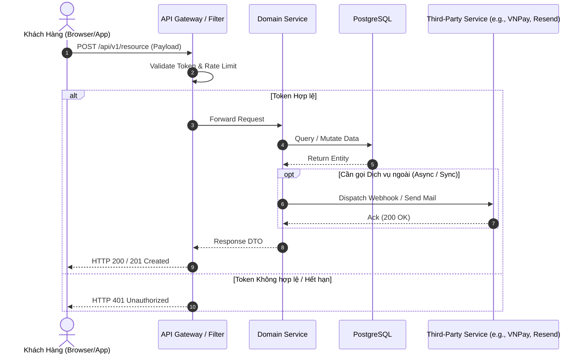
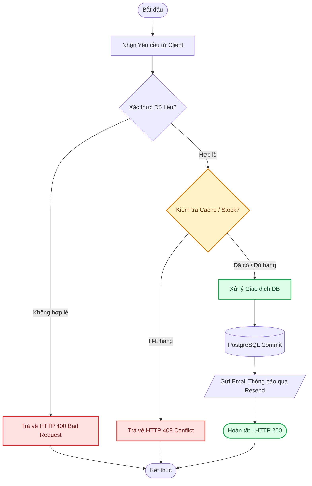
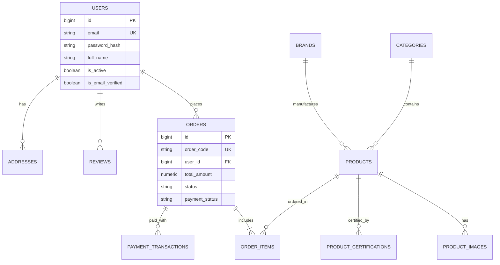
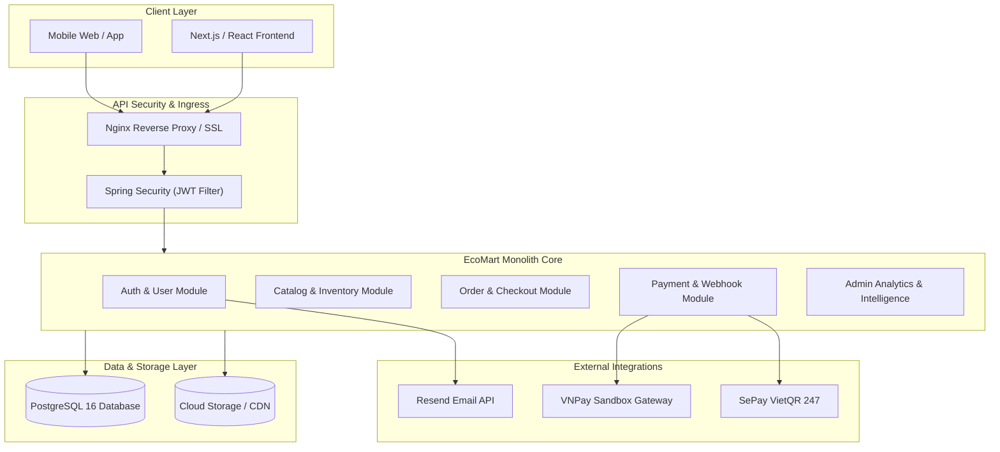

# Diagrams Architect & Visual Documentation Skill

This skill equips the agent with expert-level standards, syntax rules, color palettes, and structured templates to generate clear, bug-free, and aesthetically pleasing technical diagrams using Mermaid and visual modeling standards.

---

## 1. Core Principles for Diagramming

1. **Clarity & Purpose**: Every diagram must answer a specific architectural or business question (e.g., "What happens during checkout?", "How do microservices communicate?").
2. **Standard Color Coding & Contrast**:
   - 🟩 **Success / Core Business Path**: `#dcfce7` (border `#16a34a`, text `#14532d`)
   - 🟦 **External Systems / Integration**: `#dbeafe` (border `#2563eb`, text `#1e3a8a`)
   - 🟨 **Async / Webhook / Queue**: `#fef3c7` (border `#d97706`, text `#78350f`)
   - 🟥 **Error / Rollback / Fallback**: `#fee2e2` (border `#dc2626`, text `#7f1d1d`)
3. **Escaping & Quoting Rules**:
   - Always wrap node labels containing spaces, brackets, parentheses, colons, or special characters in double quotes: `node["Process (Step 1): Data"]`.
   - Never use raw HTML tags inside node labels.

---

## 2. Mermaid Diagram Templates & Best Practices

### A. Sequence Diagrams (Interactions & Protocols)
Use for API workflows, authentication handshakes, payment gateways, webhooks, and distributed transactions.



**Sequence Diagram Best Practices**:
- Always use `autonumber` for numbered steps.
- Group logical phases with `rect rgb(...)` and `Note over ...`.
- Explicitly label parallel paths with `par ... and ...` and conditional branches with `alt ... else ... end`.

---

### B. Flowcharts & Business Process Workflows
Use for decision trees, order status transitions, state validation, and batch jobs.



---

### C. Entity-Relationship (ER) Diagrams
Use for database schema design, entity associations, foreign keys, and cardinalities.



---

### D. Architecture / System Component Diagrams
Use for high-level system components, networking layers, microservices, and storage topology.



---

## 3. Checklist Before Outputting Diagrams

- [ ] Node IDs contain only alphanumeric characters and underscores (`Order_Svc`, `DB_1`).
- [ ] Labels with spaces or punctuation are enclosed in double quotes.
- [ ] No special characters break the parser (avoid `<` or `>` inside labels, use `&lt;` or `&gt;` if needed).
- [ ] Diagram is wrapped in standard ` ```mermaid ` code blocks.
- [ ] Workflow contains clear start, error branches, and end states.
