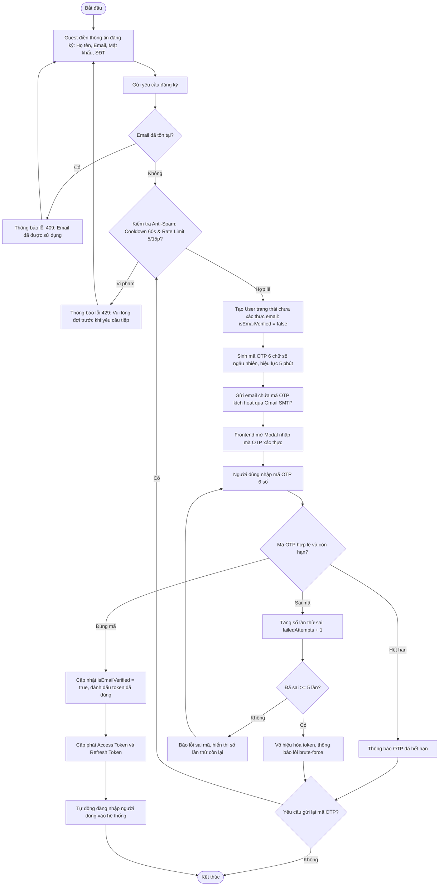
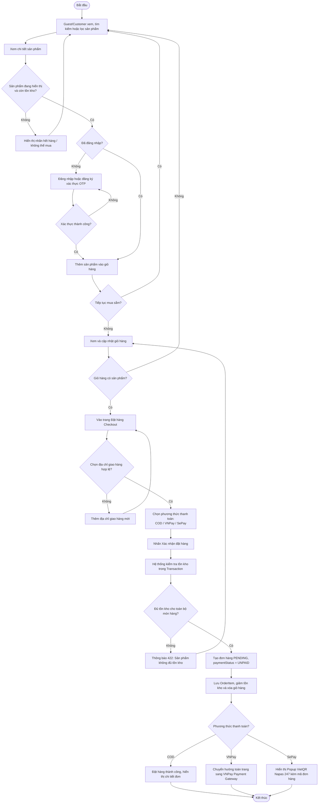
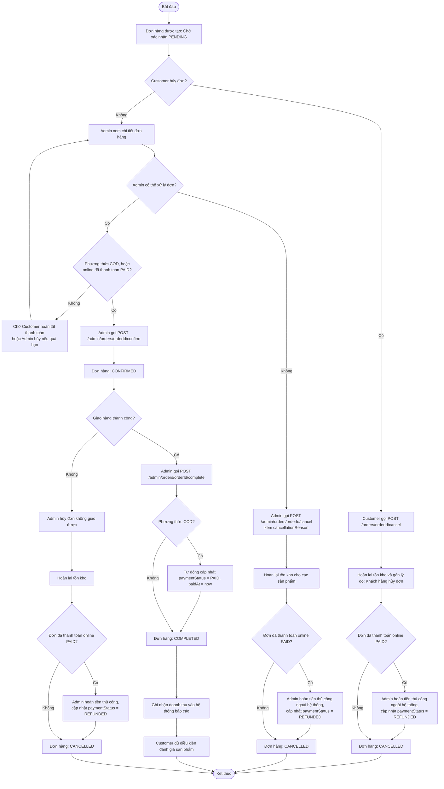
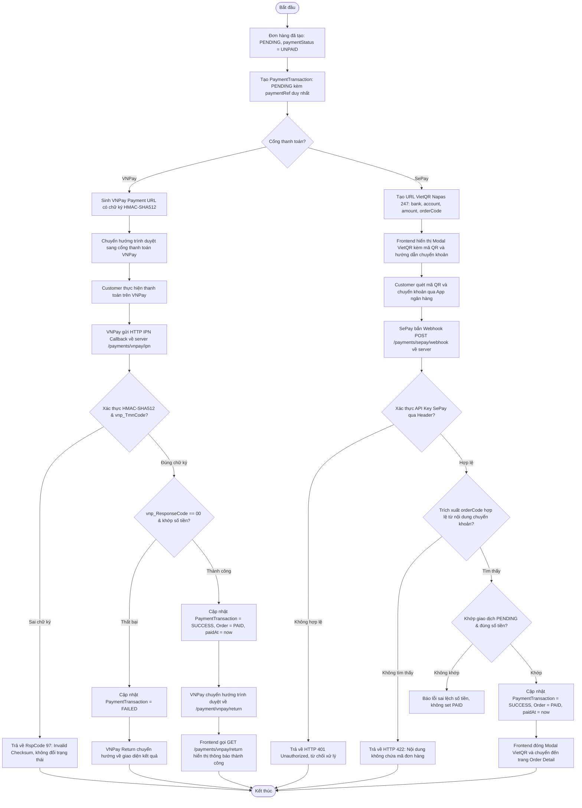

# Use Case Diagram và Activity Diagram – EcoMart

## 1. Quy ước

- Actor gồm: `Guest`, `Customer`, `Admin`.
- Customer có toàn bộ khả năng xem sản phẩm của Guest sau khi đăng nhập.
- Trạng thái đơn hàng: **Chờ xác nhận** (`PENDING`), **Đã xác nhận** (`CONFIRMED`), **Đã hoàn thành** (`COMPLETED`), **Đã hủy** (`CANCELLED`).
- Trạng thái thanh toán (độc lập với trạng thái đơn hàng): **Chưa thanh toán** (`UNPAID`), **Đã thanh toán** (`PAID`), **Thất bại** (`FAILED`), **Đã hoàn tiền** (`REFUNDED`).
- Hệ thống hỗ trợ thanh toán COD, VNPay (sandbox) và SePay (VietQR Napas 247).
- Xác thực tài khoản hỗ trợ bảo mật OTP 6 số qua Gmail SMTP, Cooldown 60s, Rate Limiting 5 lần / 15 phút, Anti-Brute-Force tối đa 5 lần thử sai. Khi chưa cấu hình SMTP, môi trường dev ghi OTP vào log.

## 2. Use Case Diagram

```mermaid
flowchart LR
    G[Guest]
    C[Customer]
    A[Admin]

    subgraph EM[Hệ thống EcoMart]
        direction TB

        subgraph Public[Chức năng công khai & Xác thực]
            UC01([Xem trang chủ])
            UC02([Xem danh mục và sản phẩm])
            UC03([Xem chi tiết sản phẩm và đánh giá])
            UC04([Tìm kiếm sản phẩm])
            UC05([Lọc và sắp xếp sản phẩm])
            UC06([Đăng ký tài khoản])
            UC40([Xác thực email qua mã OTP])
            UC41([Gửi lại mã OTP kích hoạt])
            UC07([Đăng nhập])
            UC08([Yêu cầu quên mật khẩu])
            UC42([Đặt lại mật khẩu qua mã OTP])
            UC33([Xem trang chính sách])
            UC34([Gửi liên hệ/feedback])
        end

        subgraph CustomerFeature[Chức năng Customer]
            UC09([Quản lý hồ sơ cá nhân])
            UC10([Đổi mật khẩu])
            UC11([Quản lý địa chỉ giao hàng])
            UC12([Quản lý giỏ hàng])
            UC43([Làm trống giỏ hàng])
            UC13([Đặt hàng])
            UC44([Thử lại thanh toán online])
            UC14([Theo dõi và xem chi tiết đơn hàng])
            UC15([Hủy đơn hàng chờ xác nhận])
            UC16([Xem lịch sử mua hàng])
            UC17([Đánh giá sản phẩm đã mua])
        end

        subgraph AdminFeature[Chức năng Admin]
            UC18([Xem dashboard tổng quan])
            UC45([Xem báo cáo phân tích nâng cao])
            UC19([Quản lý người dùng])
            UC20([Quản lý danh mục])
            UC21([Quản lý thương hiệu])
            UC22([Quản lý sản phẩm])
            UC23([Quản lý tồn kho])
            UC24([Quản lý đơn hàng])
            UC25([Quản lý đánh giá])
            UC35([Quản lý chứng nhận sinh thái])
            UC36([Quản lý tin nhắn liên hệ])
            UC37([Quản lý nội dung trang chính sách])
            UC38([Cấu hình thông tin cửa hàng])
        end

        subgraph Included[Use Case được bao gồm]
            UC27([Kiểm tra tồn kho])
            UC28([Chọn địa chỉ giao hàng])
            UC29([Lưu chi tiết đơn hàng và giảm tồn kho])
            UC30([Xác nhận đơn hàng])
            UC31([Hủy đơn và hoàn lại tồn kho])
            UC32([Hoàn thành đơn hàng])
            UC39([Khởi tạo giao dịch thanh toán online])
        end
    end

    G --- UC01
    G --- UC02
    G --- UC03
    G --- UC04
    G --- UC05
    G --- UC06
    G --- UC40
    G --- UC41
    G --- UC07
    G --- UC08
    G --- UC42
    G --- UC33
    G --- UC34

    C --- UC01
    C --- UC02
    C --- UC03
    C --- UC04
    C --- UC05
    C --- UC09
    C --- UC10
    C --- UC11
    C --- UC12
    C --- UC43
    C --- UC13
    C --- UC44
    C --- UC14
    C --- UC15
    C --- UC16
    C --- UC17
    C --- UC33
    C --- UC34

    A --- UC07
    A --- UC18
    A --- UC45
    A --- UC19
    A --- UC20
    A --- UC21
    A --- UC22
    A --- UC23
    A --- UC24
    A --- UC25
    A --- UC35
    A --- UC36
    A --- UC37
    A --- UC38

    UC06 -. "<<include>>" .-> UC40
    UC13 -. "<<include>>" .-> UC27
    UC13 -. "<<include>>" .-> UC28
    UC13 -. "<<include>>" .-> UC29
    UC13 -. "Điều kiện: chọn thanh toán online" .-> UC39
    UC44 -. "<<include>>" .-> UC39
    UC24 -. "<<include>>" .-> UC30
    UC24 -. "<<include>>" .-> UC31
    UC24 -. "<<include>>" .-> UC32
    UC15 -. "<<include>>" .-> UC31
    UC17 -. "Điều kiện: đơn đã hoàn thành" .-> UC14
    UC22 -. "<<include>>" .-> UC35
```

### 2.1. Ghi chú Use Case

- `Đăng ký tài khoản` kích hoạt luồng gửi mã OTP 6 chữ số qua Gmail SMTP; tài khoản ở trạng thái chưa kích hoạt (`is_email_verified = false`) cho đến khi hoàn tất `Xác thực email qua mã OTP`.
- `Đặt hàng` bao gồm kiểm tra tồn kho, chọn địa chỉ giao hàng, lưu chi tiết đơn hàng và giảm tồn kho; nếu Customer chọn thanh toán online (VNPay/SePay) thì bao gồm thêm bước khởi tạo thanh toán và mở cổng thanh toán (VNPay redirect hoặc modal VietQR).
- `Thử lại thanh toán online` cho phép Customer tạo lại phiên thanh toán mới cho đơn hàng `PENDING` chưa thanh toán.
- `Quản lý đơn hàng` của Admin bao gồm xác nhận, hủy hoặc hoàn thành đơn theo trạng thái hợp lệ; đơn thanh toán online chỉ xác nhận được khi trạng thái thanh toán là Đã thanh toán (`PAID`).
- Customer chỉ hủy được đơn ở trạng thái **Chờ xác nhận** (`PENDING`).
- Đánh giá sản phẩm chỉ được thực hiện sau khi Customer có đơn hàng **Đã hoàn thành** (`COMPLETED`) chứa sản phẩm đó.
- `Báo cáo phân tích nâng cao` bao gồm 12 báo cáo và biểu đồ chuyên sâu: Doanh thu theo ngày/tháng/năm, Top bán chạy, Tỷ trọng danh mục/thương hiệu, Cơ cấu phương thức thanh toán, Tăng trưởng khách hàng, Khách hàng VIP, Cảnh báo tồn kho thấp (<= 5), Chất lượng đánh giá, và Tác động sinh thái Eco Impact.

---

## 3. Activity Diagram – Đăng ký & Xác thực Email OTP

---

## 4. Activity Diagram – Quy trình mua hàng & Đặt hàng

---

## 5. Activity Diagram – Quy trình xử lý đơn hàng (Admin & Customer)

### 5.1. Bảng quy tắc chuyển trạng thái đơn hàng

| Trạng thái hiện tại | Điều kiện thanh toán | Tác nhân | Hành động hợp lệ | Trạng thái sau xử lý | Tác động tồn kho / thanh toán |
|---|---|---|---|---|---|
| `PENDING` | Bất kỳ | Customer | Hủy đơn | `CANCELLED` | Hoàn tồn kho; ghi nhận cần hoàn tiền nếu `PAID` |
| `PENDING` | `COD`, hoặc online `PAID` | Admin | Xác nhận đơn (`/confirm`) | `CONFIRMED` | Ghi nhận `confirmedAt` |
| `PENDING` | Online `UNPAID` | Admin | Không được xác nhận | Giữ `PENDING` | Chờ thanh toán hoặc hủy |
| `PENDING` | Bất kỳ | Admin | Hủy đơn (`/cancel`) | `CANCELLED` | Hoàn tồn kho; lưu lý do hủy Admin nhập |
| `CONFIRMED` | Bất kỳ | Admin | Hoàn thành đơn (`/complete`) | `COMPLETED` | Ghi nhận `completedAt`; nếu COD set `PAID` |
| `CONFIRMED` | Bất kỳ | Admin | Hủy đơn (`/cancel`) | `CANCELLED` | Hoàn tồn kho; lưu lý do hủy Admin nhập |
| `COMPLETED` | — | Không áp dụng | Không thể chuyển trạng thái | Không áp dụng | Không thay đổi |
| `CANCELLED` | `PAID` (Online) | Admin | Cập nhật hoàn tiền (`/payment-status`) | `CANCELLED` | Chuyển `paymentStatus` sang `REFUNDED` |

---

## 6. Activity Diagram – Thanh toán online (VNPay Sandbox & SePay VietQR)

---

## 7. Đối chiếu mã Use Case với Business Analysis

| Mã sơ đồ | Tên Use Case | Mã Use Case trong BA |
|---|---|---|
| `UC01`–`UC05` | Trang chủ, danh mục, chi tiết, tìm kiếm, lọc & sắp xếp | `UC-G-01` đến `UC-G-06` |
| `UC06`, `UC40`, `UC41` | Đăng ký tài khoản, xác thực email qua OTP, gửi lại OTP | `UC-G-07`, `FR-60`, `FR-61` |
| `UC07` | Đăng nhập tài khoản (Customer & Admin) | `UC-G-08`, `UC-A-01` |
| `UC08`, `UC42` | Quên mật khẩu & đặt lại mật khẩu qua OTP | `UC-G-09`, `FR-62` |
| `UC33`, `UC34` | Xem trang chính sách & gửi liên hệ/feedback | `UC-G-10`, `UC-G-11` |
| `UC09`–`UC11` | Quản lý hồ sơ, đổi mật khẩu, quản lý sổ địa chỉ | `UC-C-01` đến `UC-C-03` |
| `UC12`, `UC43` | Quản lý giỏ hàng, cập nhật số lượng & làm trống giỏ | `UC-C-04` đến `UC-C-07` |
| `UC13`, `UC44` | Đặt hàng (COD/Online) & Thử lại thanh toán online | `UC-C-08`, `FR-55`, `FR-56` |
| `UC14`–`UC16` | Theo dõi đơn hàng, hủy đơn chờ xác nhận, xem lịch sử | `UC-C-09` đến `UC-C-12` |
| `UC17` | Đánh giá sản phẩm sau khi đơn hoàn thành | `UC-C-13` |
| `UC18`, `UC45` | Dashboard tổng quan & 12 báo cáo phân tích chuyên sâu | `UC-A-02`, `UC-A-13`, `FR-67` |
| `UC19`–`UC25` | Quản lý người dùng, danh mục, thương hiệu, sản phẩm, tồn kho, đơn hàng, đánh giá | `UC-A-03` đến `UC-A-12` |
| `UC35`–`UC38` | Quản lý chứng nhận, tin nhắn liên hệ, nội dung trang, cấu hình cửa hàng | `UC-A-14` đến `UC-A-17` |
| `UC27`–`UC32`, `UC39` | Các hành động con: Kiểm tra tồn kho, chọn địa chỉ, trừ tồn kho, xác nhận, hủy/hoàn kho, hoàn thành, khởi tạo thanh toán | Include / Actions |
