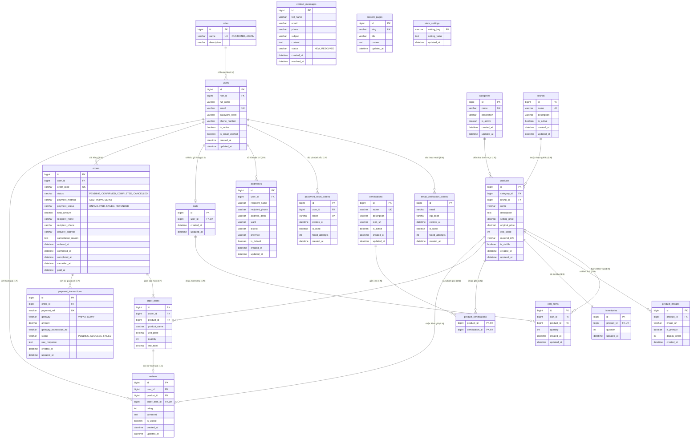

# ERD – EcoMart

## 1. Mục đích và giả định thiết kế

ERD này phản ánh chính xác cấu trúc dữ liệu đang được triển khai trong mã nguồn Backend (Spring Data JPA Entities & PostgreSQL Schema). Các tên bảng, cột và kiểu dữ liệu tuân thủ chuẩn 3NF và kiến trúc thực tế của hệ thống EcoMart.

Các nguyên tắc và giả định thiết kế thực tế:

- `users` lưu thông tin tài khoản cho cả `CUSTOMER` và `ADMIN`, vai trò được phân định thông qua khóa ngoại `role_id` đến bảng `roles`.
- Xác thực tài khoản hỗ trợ bảo mật OTP: `email_verification_tokens` lưu mã OTP kích hoạt tài khoản 6 chữ số (hạn 5 phút), và `password_reset_tokens` lưu mã OTP/token đặt lại mật khẩu (hạn 15 phút). Cả 2 đều có cơ chế chống brute-force (tối đa 5 lần thử sai) và kiểm soát tần suất (Cooldown 60s, Rate Limiting 5 lần / 15 phút).
- `users.is_email_verified` (mặc định `false`) đảm bảo người dùng chỉ có thể đăng nhập sau khi xác thực OTP email thành công.
- Mỗi `products` có một bản ghi tồn kho tương ứng trong `inventories`.
- Thông tin giao hàng được lưu trực tiếp tại `orders` dưới dạng bản chụp tại thời điểm đặt hàng (`recipient_name`, `recipient_phone`, `delivery_address`). Khách hàng sửa/xóa địa chỉ trong `addresses` không làm thay đổi lịch sử đơn hàng cũ.
- `order_items` lưu snapshot tên sản phẩm (`product_name`), đơn giá (`unit_price`) và thành tiền (`line_total`) tại thời điểm đặt hàng.
- Mỗi `reviews` bắt buộc liên kết duy nhất với một `order_items` (`order_item_id` UNIQUE FK) để đảm bảo chỉ khách hàng đã mua sản phẩm trong đơn hoàn thành (`COMPLETED`) mới được đánh giá.
- Hệ thống hỗ trợ 3 phương thức thanh toán (`COD`, `VNPAY`, `SEPAY`). Các lần thử thanh toán online được lưu trong `payment_transactions` với mã tham chiếu duy nhất `payment_ref`.
- Cấu hình cửa hàng lưu dạng key-value trong `store_settings`, các trang chính sách tĩnh lưu trong `content_pages` tra cứu theo `slug`, và tin nhắn liên hệ lưu trong `contact_messages`.

---

## 2. Entity Relationship Diagram

---

## 3. Data Dictionary – Chi tiết 21 Bảng Dữ liệu

| STT | Tên bảng (Table) | Khóa chính (PK) | Khóa ngoại (FK) | Mục đích nghiệp vụ |
|---|---|---|---|---|
| 1 | `roles` | `id` | Không | Định nghĩa vai trò tài khoản (`CUSTOMER`, `ADMIN`). |
| 2 | `users` | `id` | `role_id` $\to$ `roles(id)` | Tài khoản khách hàng & quản trị viên. |
| 3 | `email_verification_tokens` | `id` | Không | Mã OTP 6 số kích hoạt tài khoản qua email (Resend API). |
| 4 | `password_reset_tokens` | `id` | `user_id` $\to$ `users(id)` | Mã OTP/Token đặt lại mật khẩu. |
| 5 | `addresses` | `id` | `user_id` $\to$ `users(id)` | Sổ địa chỉ giao hàng của khách hàng. |
| 6 | `categories` | `id` | Không | Danh mục sản phẩm thân thiện môi trường. |
| 7 | `brands` | `id` | Không | Thương hiệu xanh đối tác. |
| 8 | `certifications` | `id` | Không | Danh mục chứng nhận sinh thái (Nhãn xanh, FSC, Organic,...). |
| 9 | `products` | `id` | `category_id`, `brand_id` | Sản phẩm đang hoặc đã từng kinh doanh. |
| 10 | `product_images` | `id` | `product_id` $\to$ `products(id)` | Hình ảnh chi tiết của sản phẩm. |
| 11 | `product_certifications` | `product_id` + `certification_id` | `product_id`, `certification_id` | Bảng liên kết nhiều-nhiều giữa sản phẩm và chứng nhận. |
| 12 | `inventories` | `id` | `product_id` $\to$ `products(id)` (UNIQUE) | Quản lý số lượng tồn kho khả dụng của sản phẩm. |
| 13 | `carts` | `id` | `user_id` $\to$ `users(id)` (UNIQUE) | Giỏ hàng hiện tại của mỗi khách hàng. |
| 14 | `cart_items` | `id` | `cart_id`, `product_id` | Chi tiết sản phẩm và số lượng trong giỏ. |
| 15 | `orders` | `id` | `user_id` $\to$ `users(id)` | Đơn hàng và thông tin nhận hàng snapshot. |
| 16 | `order_items` | `id` | `order_id`, `product_id` | Snapshot sản phẩm, đơn giá và số lượng trong đơn. |
| 17 | `payment_transactions` | `id` | `order_id` $\to$ `orders(id)` | Lịch sử các lần thử thanh toán online (VNPay/SePay). |
| 18 | `reviews` | `id` | `user_id`, `product_id`, `order_item_id` | Đánh giá sao (1-5) và nhận xét của khách hàng. |
| 19 | `contact_messages` | `id` | Không | Tin nhắn liên hệ/feedback từ khách hàng. |
| 20 | `content_pages` | `id` | Không | Nội dung trang chính sách tĩnh (`slug`: `return-policy`, `warranty-policy`, `shipping-policy`). |
| 21 | `store_settings` | `setting_key` | Không | Cấu hình cửa hàng key-value (SĐT, Email, Địa chỉ, Map Embed URL). |

---

## 4. Ràng buộc toàn vẹn & Quy tắc nghiệp vụ (Integrity Constraints)

| Mã | Ràng buộc | Thực thi trong Implementation |
|---|---|---|
| **ERD-R-01** | Email duy nhất | `users.email` có ràng buộc `UNIQUE` (case-insensitive). |
| **ERD-R-02** | Giỏ hàng duy nhất | `carts.user_id` có ràng buộc `UNIQUE` (1 User $\le$ 1 Cart). |
| **ERD-R-03** | Món hàng duy nhất trong giỏ | Cặp (`cart_id`, `product_id`) có ràng buộc `UNIQUE` trong `cart_items`. |
| **ERD-R-04** | Tồn kho không âm | `inventories.quantity >= 0`. Kiểm tra và trừ tồn kho khi tạo đơn, hoàn tồn kho khi hủy đơn. |
| **ERD-R-05** | Giá bán dương | `products.selling_price > 0`, `order_items.unit_price > 0`. |
| **ERD-R-06** | Giá khuyến mại | `products.original_price` (nếu có) phải lớn hơn `selling_price`. |
| **ERD-R-07** | Điểm Eco-Score | `products.eco_score` (nếu có) là số nguyên từ 1 đến 5. |
| **ERD-R-08** | Khóa giao dịch tồn kho | Khi checkout (`POST /orders`), khóa các dòng `inventories` theo thứ tự `product_id` tăng dần để chống oversell khi đồng thời thanh toán. |
| **ERD-R-09** | Snapshot đơn hàng | `order_items` lưu độc lập `product_name`, `unit_price`, `quantity`, `line_total` tại thời điểm đặt; `orders.total_amount` bằng tổng các `line_total`. |
| **ERD-R-10** | Trạng thái đơn hàng | `orders.status` chỉ nhận: `PENDING`, `CONFIRMED`, `COMPLETED`, `CANCELLED`. |
| **ERD-R-11** | Phương thức thanh toán | `orders.payment_method` chỉ nhận: `COD`, `VNPAY`, `SEPAY`. |
| **ERD-R-12** | Trạng thái thanh toán | `orders.payment_status` chỉ nhận: `UNPAID`, `PAID`, `FAILED`, `REFUNDED`. Mặc định `UNPAID`. |
| **ERD-R-13** | Đánh giá hợp lệ | `reviews.order_item_id` có ràng buộc `UNIQUE`. Chỉ tạo được review khi đơn hàng tương ứng đã `COMPLETED`. |
| **ERD-R-14** | Điểm đánh giá | `reviews.rating` chỉ nhận số nguyên từ 1 đến 5. |
| **ERD-R-15** | Khóa ngoại mềm | Không xóa cứng danh mục, thương hiệu, chứng nhận hoặc sản phẩm đã phát sinh dữ liệu đơn hàng; sử dụng `is_active` hoặc `is_visible`. |
| **ERD-R-16** | Chống Brute-force OTP | `email_verification_tokens.failed_attempts` và `password_reset_tokens.failed_attempts` tự vô hiệu hóa token khi vượt quá 5 lần nhập sai. |
| **ERD-R-17** | Idempotency Webhook | `payment_transactions` có ràng buộc `UNIQUE(gateway, gateway_transaction_no)`. Webhook gọi lại nhiều lần không tạo giao dịch trùng lặp. |
| **ERD-R-18** | Hoàn tiền thủ công | Chuyển `orders.payment_status` sang `REFUNDED` là thao tác ghi nhận thủ công của Admin sau khi hoàn tiền ngoài hệ thống, chỉ áp dụng cho đơn `CANCELLED` đã thanh toán `PAID`. |
