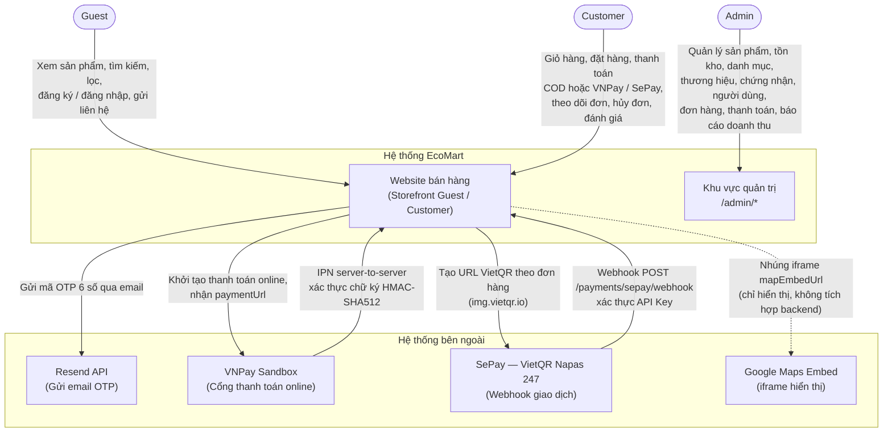

# System Context Diagram – EcoMart

## Purpose

Mô tả ranh giới (boundary) của hệ thống EcoMart, các actor bên ngoài tương tác với hệ thống và các hệ thống bên ngoài mà EcoMart tích hợp.

## Source

- BA §1.3 Phạm vi hệ thống, §2.4 Quy trình thanh toán online, §3 Actor
- FR-55…FR-57 (thanh toán online & webhook/IPN), FR-60…62 (OTP qua email)
- BR-19, BR-40, BR-43 (3 phương thức thanh toán; xác thực webhook)
- README Tech Stack; FR-53/54 (Google Maps chỉ nhúng iframe hiển thị)

## Diagram

### Ghi chú

- EcoMart là **monolith 3 tầng** (React SPA + Spring Boot REST + PostgreSQL), không phải marketplace hay microservice (BA §1.4, CLAUDE.md).
- Hoàn tiền **không** gọi API cổng thanh toán: Admin xử lý thủ công ngoài hệ thống rồi cập nhật trạng thái `REFUNDED` (BR-42, ERD-R-18).
- Google Maps không được gọi từ backend; chỉ nhúng iframe qua `store_settings.mapEmbedUrl` (BA §1.7, FR-53/54).
