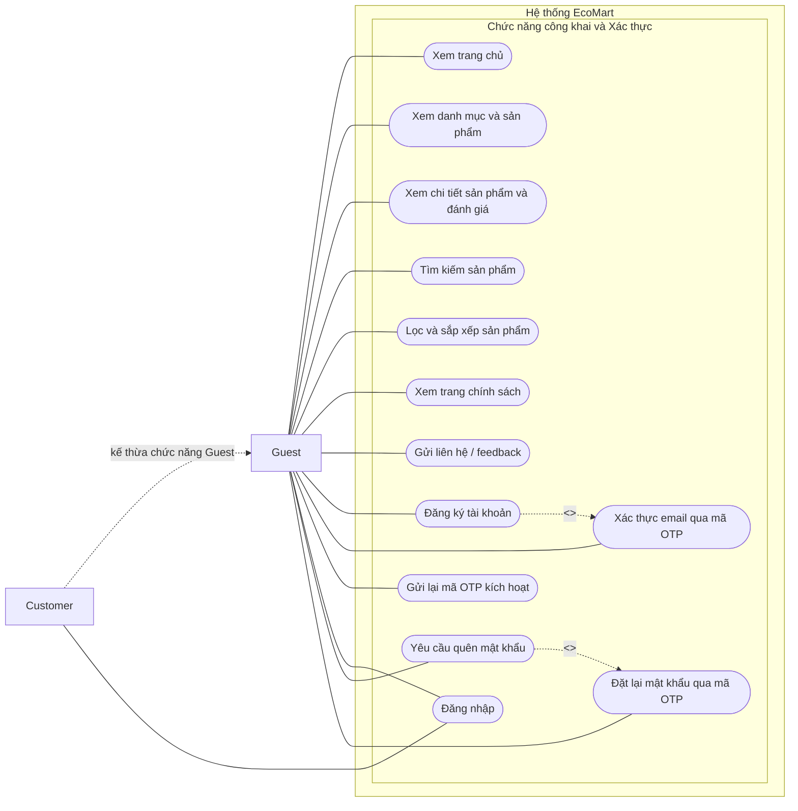
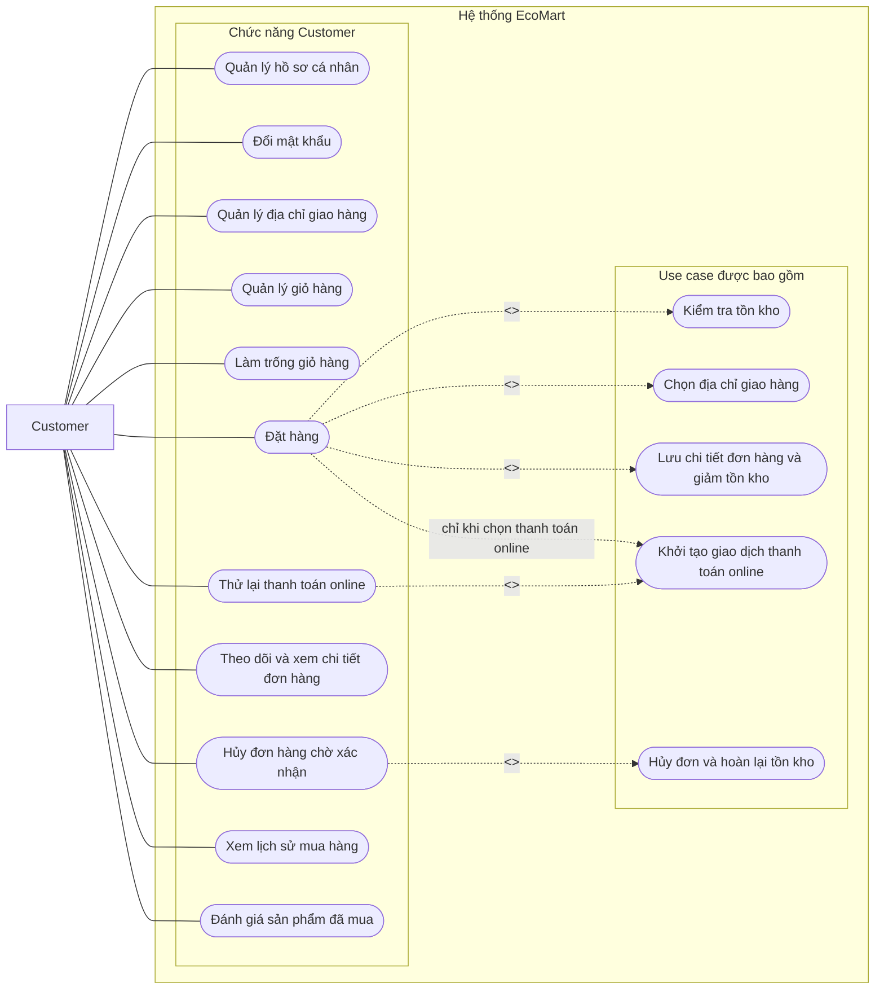
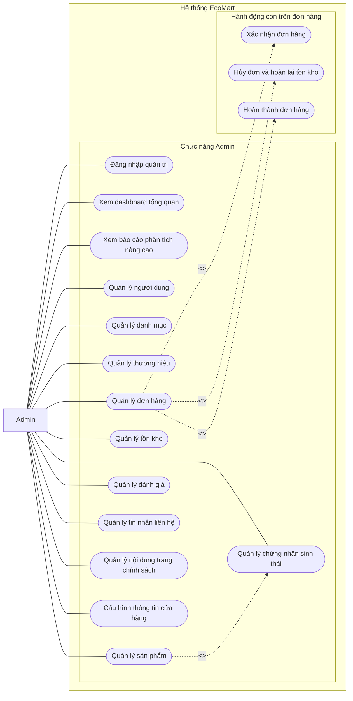

# Use Case Diagrams – EcoMart

## Purpose

Mô tả các use case của hệ thống EcoMart theo từng nhóm actor: (1) Chức năng công khai & Xác thực, (2) Chức năng Customer, (3) Chức năng Admin. Use case quá lớn nên được chia thành 3 diagram theo domain để dễ đọc; mã use case giữ nguyên ký hiệu `UC…` trong tài liệu Diagrams.

## Source

- BA §6 Use Case List (UC-G-*, UC-C-*, UC-A-*), §4 Functional Requirements
- docs/02_EcoMart_Diagrams.md §2 (bảng đối chiếu UC01–UC45) và §2.1 Ghi chú Use Case
- BR-21/22/27/28 (điều kiện hủy đơn, xác nhận đơn, đánh giá)

## Diagram

### 1. Chức năng công khai & Xác thực (Guest / Customer)

### 2. Chức năng Customer

### 3. Chức năng Admin

## Ghi chú nghiệp vụ (từ BA/docs)

- `Đăng ký tài khoản` kích hoạt OTP 6 số qua Resend API; tài khoản chưa kích hoạt (`is_email_verified = false`) không đăng nhập được cho đến khi hoàn tất `Xác thực email qua mã OTP`.
- `Đặt hàng` include kiểm tra tồn kho, chọn địa chỉ, lưu chi tiết đơn và giảm tồn kho; nếu chọn thanh toán online thì khởi tạo thêm giao dịch thanh toán và mở cổng (VNPay redirect hoặc modal VietQR).
- Customer chỉ hủy được đơn ở trạng thái **Chờ xác nhận** (`PENDING`) — BR-21.
- Admin xác nhận đơn online chỉ khi trạng thái thanh toán là **Đã thanh toán** (`PAID`) — BR-22.
- `Đánh giá sản phẩm đã mua` chỉ hợp lệ với sản phẩm thuộc đơn **Đã hoàn thành** (`COMPLETED`) của chính Customer đó — BR-27/28 (điều kiện này do API thực thi tại `POST /reviews`, không phải một use case riêng).
- `UC31` xuất hiện ở cả diagram Customer và Admin vì cả hai actor đều kích hoạt hành động hủy kèm hoàn tồn kho (BR-21/23).
