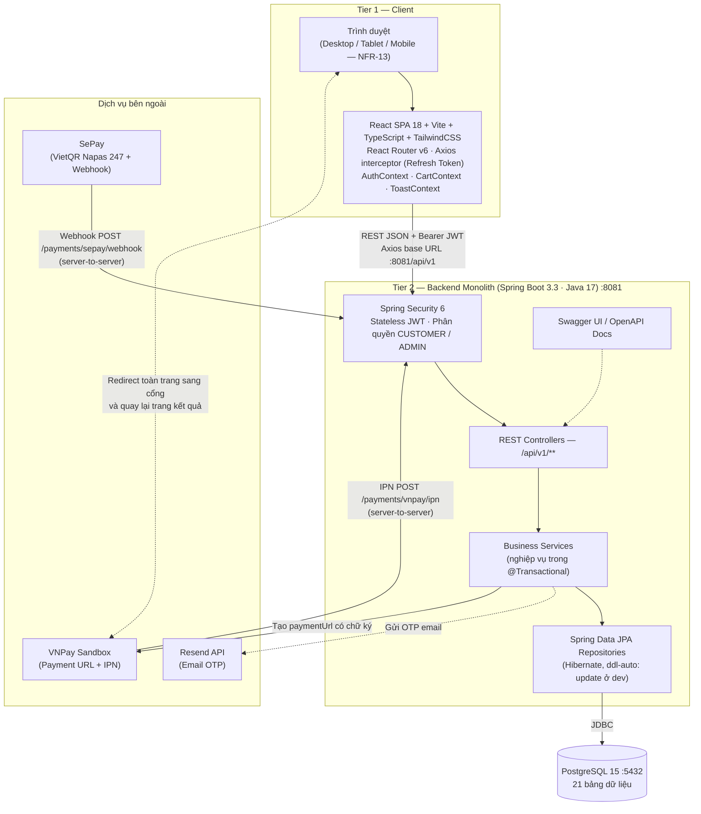

# System Architecture Diagram – EcoMart

## Purpose

Mô tả kiến trúc logic của EcoMart theo đúng những gì tài liệu mô tả: monolith 3 tầng (React SPA → Spring Boot REST API → PostgreSQL) cùng các dịch vụ bên ngoài được tích hợp.

## Source

- README Tech Stack (Spring Boot 3.3.x, Java 17, Spring Security 6 stateless JWT, Spring Data JPA/Hibernate, PostgreSQL 15, React 18 + Vite + TS + TailwindCSS, Axios, Context API, Resend API, VNPay Sandbox HMAC-SHA512 IPN, SePay VietQR Napas 247, Docker Compose)
- CLAUDE.md (Monolithic 3-Tier; NO microservices/DDD/CQRS)
- architecture/backend_rules.md + project_context.md (4 tầng Controller → Service → Repository)
- API Specification §1–§2 (Base URL :8081, `/api/v1`, Bearer JWT, Swagger UI)

## Diagram

### Ghi chú

- Webhook/IPN đi thẳng vào backend và được xác thực chữ ký/checksum trước khi cập nhật dữ liệu; **không** tin dữ liệu redirect từ trình duyệt (BR-40/43, NFR-19).
- Triển khai bằng Docker Compose: postgres (:5432) + backend (:8081) + frontend/nginx (:3000); dev local chạy Vite tại :5173 (README).
- Không có message broker, cache layer hay service riêng nào khác trong phạm vi tài liệu — `NOT SPECIFIED` ngoài các thành phần trên.
