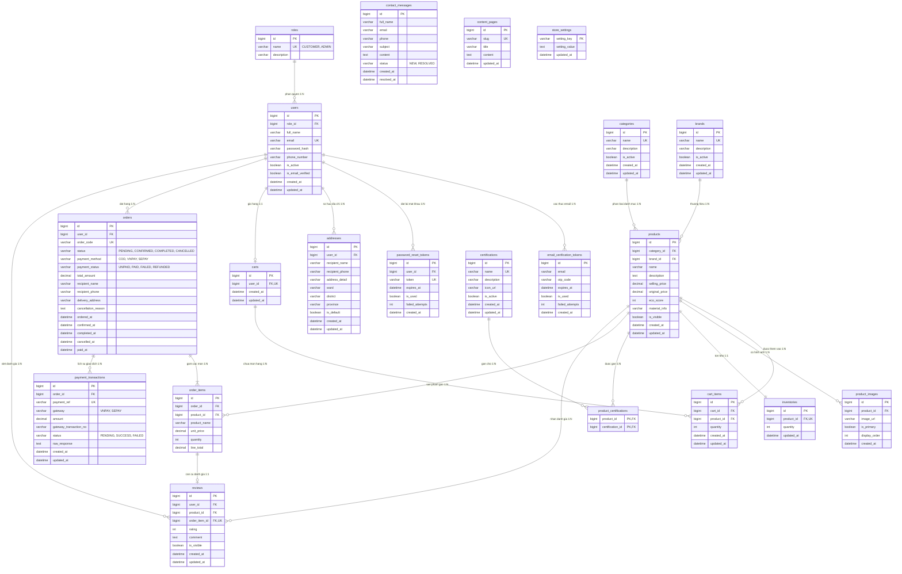

# Entity Relationship Diagram (ERD) – EcoMart

## Purpose

Mô tả cấu trúc dữ liệu của EcoMart: 21 bảng, khóa chính/ngoại, ràng buộc và cardinality. Đây là ERD của record, phản ánh trực tiếp thiết kế đã được triển khai.

## Source

- docs/03_EcoMart_ERD.md §2 (ERD), §3 (Data Dictionary), §4 (Integrity Constraints ERD-R-01…18)
- docs/04_EcoMart_database_design.md §4–§8 (21 bảng, enums, transaction rules)
- BA §9 Entity nghiệp vụ + §9.1 Quan hệ nghiệp vụ chính

## Diagram

## Ràng buộc toàn vẹn chính

| Mã | Ràng buộc | Nguồn |
|---|---|---|
| ERD-R-01 | `users.email` UNIQUE | BR-01/02 |
| ERD-R-02/03 | 1 User ≤ 1 Cart; `(cart_id, product_id)` UNIQUE trong `cart_items` | BR-14 |
| ERD-R-04/05/06 | Tồn kho ≥ 0; giá bán > 0; `original_price` > `selling_price` | BR-11/12/37 |
| ERD-R-07/14 | `eco_score`, `rating` là số nguyên 1–5 | BR-29/35 |
| ERD-R-08 | Checkout khóa dòng `inventories` theo thứ tự `product_id` tăng dần chống oversell | API §6.4 |
| ERD-R-09 | `order_items` lưu snapshot tên/giá/số lượng tại thời điểm đặt | BR-17 |
| ERD-R-13 | `reviews.order_item_id` UNIQUE — chỉ review khi đơn `COMPLETED` | BR-27/28 |
| ERD-R-15 | Không xóa cứng category/brand/certification/product đã có dữ liệu đơn | BR-31/32/36 |
| ERD-R-16 | Token OTP tự vô hiệu hóa sau 5 lần sai | FR-66 |
| ERD-R-17 | `UNIQUE(gateway, gateway_transaction_no)` — webhook idempotent | BR-41 |
| ERD-R-18 | `REFUNDED` chỉ do Admin ghi nhận thủ công trên đơn `CANCELLED` đã `PAID` | BR-42 |
