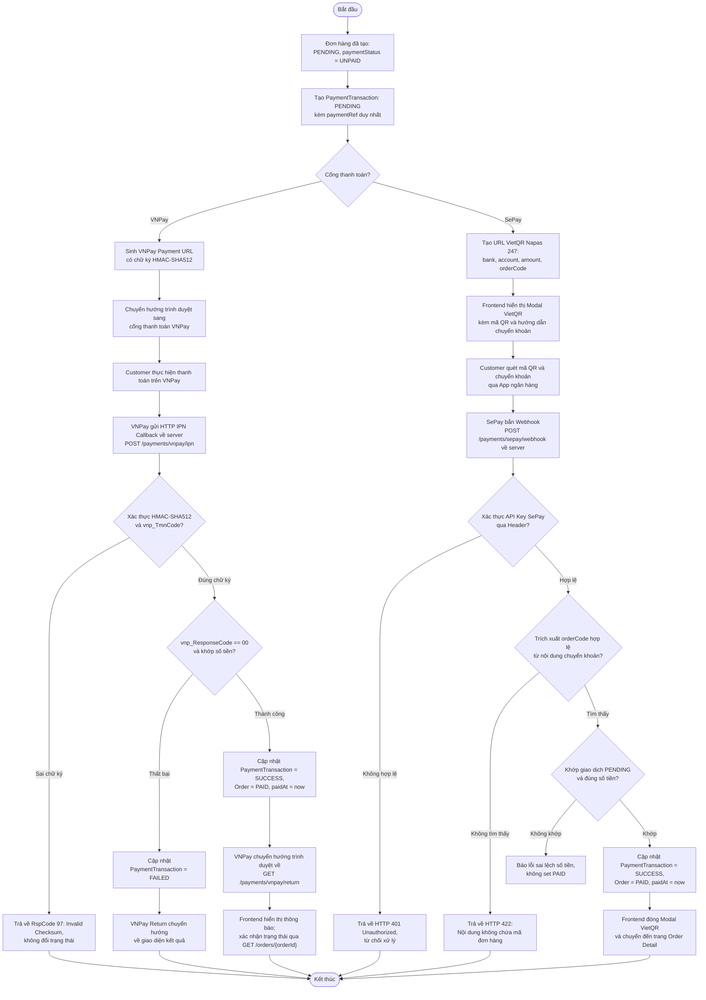

# Activity Diagram – Thanh toán online (VNPay Sandbox & SePay VietQR)

## Purpose

Mô tả luồng thanh toán online cho hai cổng được hỗ trợ: VNPay Sandbox (redirect + IPN HMAC-SHA512) và SePay VietQR Napas 247 (modal QR + webhook API Key), với nguyên tắc bắt buộc xác thực webhook trước khi cập nhật trạng thái.

## Source

- docs/02_EcoMart_Diagrams.md §6
- FR-55…FR-58; BR-19, BR-40…BR-43; NFR-19/20
- API §6.6 Payment Gateway Webhook API; ERD-R-17 (idempotency)

## Diagram

## Business Rules áp dụng

| Rule | Ý nghĩa trong luồng |
|---|---|
| BR-40/NFR-19 | Chỉ set `PAID` khi nhận và xác thực thành công webhook/IPN; không tin redirect từ trình duyệt |
| BR-43 | Yêu cầu chữ ký/checksum không hợp lệ bị từ chối và **không** làm thay đổi dữ liệu |
| BR-41/ERD-R-17 | Nhiều lần thử thanh toán là bình thường; webhook gọi lại không tạo giao dịch trùng (`UNIQUE(gateway, gateway_transaction_no)`) |
| FR-57/NFR-20 | Secret key của cổng chỉ tồn tại phía backend, không lộ ra response |
| BR-42 | Hoàn tiền (nếu có) là thao tác thủ công của Admin ngoài hệ thống — xem [order-processing.md](order-processing.md) |
