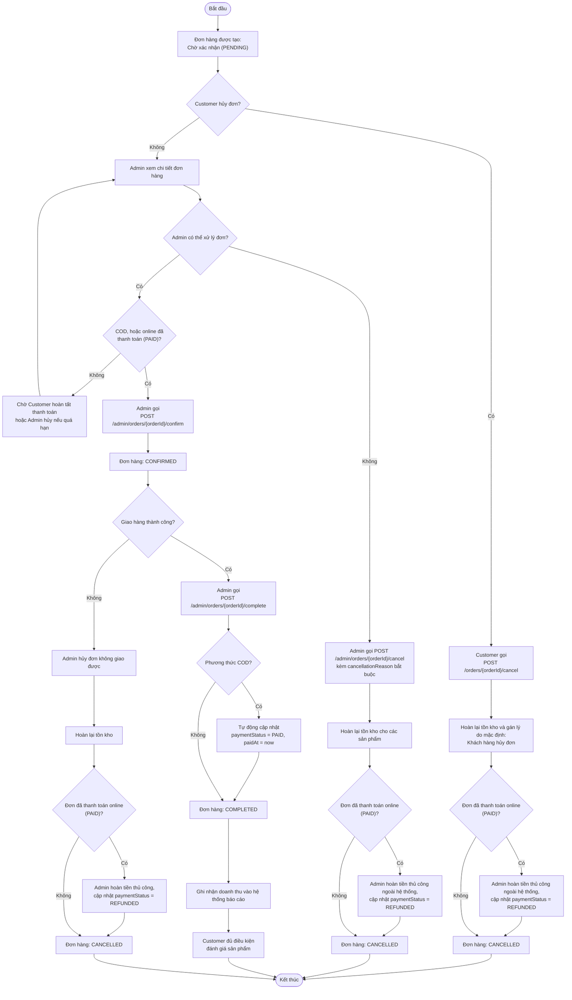

# Activity Diagram – Quy trình xử lý đơn hàng (Admin & Customer)

## Purpose

Mô tả vòng đời xử lý đơn hàng: Customer/Admin hủy đơn, Admin xác nhận và hoàn thành đơn, kèm các ràng buộc về tồn kho, trạng thái thanh toán và hoàn tiền thủ công.

## Source

- docs/02_EcoMart_Diagrams.md §5 + bảng quy tắc chuyển trạng thái §5.1
- BR-20…BR-25, BR-34; API §7.5 (quy tắc `/confirm`, `/cancel`, `/complete`, `/payment-status`)
- ERD-R-18 (hoàn tiền thủ công)

## Diagram

## Bảng quy tắc chuyển trạng thái đơn hàng

| Trạng thái hiện tại | Điều kiện thanh toán | Tác nhân | Hành động hợp lệ | Trạng thái sau | Tác động |
|---|---|---|---|---|---|
| `PENDING` | Bất kỳ | Customer | Hủy đơn | `CANCELLED` | Hoàn tồn kho; ghi nhận cần hoàn tiền nếu `PAID` |
| `PENDING` | `COD` hoặc online `PAID` | Admin | Xác nhận (`/confirm`) | `CONFIRMED` | Ghi nhận `confirmedAt` |
| `PENDING` | Online `UNPAID` | Admin | Không được xác nhận (`409`) | Giữ `PENDING` | Chờ thanh toán hoặc hủy |
| `PENDING` / `CONFIRMED` | Bất kỳ | Admin | Hủy (`/cancel`) | `CANCELLED` | Hoàn tồn kho; lưu lý do Admin nhập |
| `CONFIRMED` | Bất kỳ | Admin | Hoàn thành (`/complete`) | `COMPLETED` | Ghi nhận `completedAt`; COD tự set `PAID`; tính doanh thu |
| `COMPLETED` / `CANCELLED` | — | Không áp dụng | Không thể chuyển trạng thái khác | Không áp dụng | BR-25/BR-34 |
