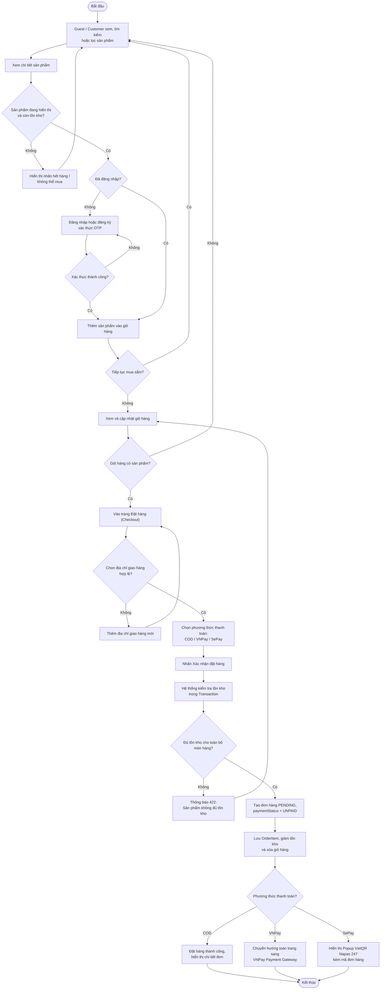

# Activity Diagram – Quy trình mua hàng & Đặt hàng

## Purpose

Mô tả luồng mua hàng từ khi duyệt sản phẩm, thêm giỏ, đến khi tạo đơn hàng và điều hướng theo phương thức thanh toán (COD / VNPay / SePay).

## Source

- docs/02_EcoMart_Diagrams.md §4
- BA §2.1 Quy trình mua hàng; FR-19…24, FR-55, FR-56
- BR-04, BR-09, BR-13…18 (điều kiện giỏ hàng, kiểm tra tồn kho, snapshot giá)

## Diagram

## Business Rules áp dụng

| Rule | Ý nghĩa trong luồng |
|---|---|
| BR-09/BR-13 | Chỉ sản phẩm đang hiển thị và còn tồn kho được thêm vào giỏ |
| BR-15 | Giỏ rỗng không đặt hàng được |
| BR-16 | Kiểm tra lại tồn kho toàn bộ giỏ trước khi tạo đơn (API trả `422` nếu thiếu) |
| BR-17/BR-18 | Tạo đơn: lưu giá/số lượng vào `order_items`, giảm tồn kho tương ứng |
| FR-56 | Đơn online: tạo `PaymentTransaction` và chuyển hướng sang cổng thanh toán |

> Sau khi đơn được tạo, luồng tiếp theo xem: [order-processing.md](order-processing.md) và [online-payment-gateways.md](online-payment-gateways.md).
