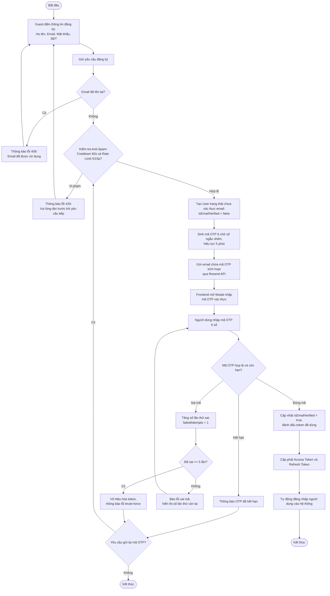

# Activity Diagram – Đăng ký & Xác thực Email OTP

## Purpose

Mô tả luồng nghiệp vụ đăng ký tài khoản Customer và kích hoạt tài khoản bằng mã OTP 6 chữ số gửi qua email, gồm các quy tắc chống spam và chống brute-force.

## Source

- docs/02_EcoMart_Diagrams.md §3
- FR-09, FR-60, FR-61, FR-65, FR-66; NFR-21, NFR-22
- API §4.1–§4.3 (`register`, `verify-email`, `resend-verification`)
- ERD-R-16 (tự vô hiệu hóa token sau 5 lần sai)

## Diagram

## Business Rules áp dụng

| Rule | Ý nghĩa trong luồng |
|---|---|
| BR-01/BR-02 | Email duy nhất, đúng định dạng → lỗi `409` nếu trùng |
| FR-65/NFR-21 | Cooldown 60s giữa 2 lần gửi; tối đa 5 yêu cầu / 15 phút mỗi email → `429` |
| FR-66/NFR-22 | Sai quá 5 lần liên tiếp → token bị vô hiệu hóa (chống brute-force) |
| OTP hết hạn | 5 phút cho OTP kích hoạt; gửi lại qua `resend-verification` |
