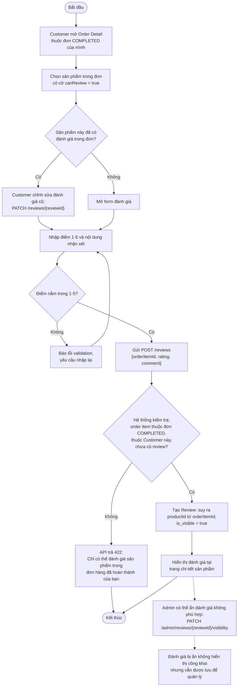

# Activity Diagram – Đánh giá sản phẩm

## Purpose

Mô tả luồng Customer đánh giá sản phẩm đã mua và quy tắc điều kiện đánh giá, kèm hành vi ẩn/hiện đánh giá của Admin.

## Source

- FR-29, FR-30, FR-41; BR-27…BR-30
- API §6.5 (`POST /reviews`, `PATCH /reviews/{reviewId}`) — hệ thống tự suy ra `productId` từ `orderItemId`, trả `422` nếu không đủ điều kiện
- ERD-R-13 (`reviews.order_item_id` UNIQUE), ERD-R-14 (rating 1–5)

## Diagram

## Business Rules áp dụng

| Rule | Ý nghĩa trong luồng |
|---|---|
| BR-27 | Chỉ đánh giá sản phẩm thuộc đơn `COMPLETED` của chính Customer |
| BR-28 | Mỗi Customer một đánh giá cho mỗi sản phẩm trong một đơn hoàn thành (`order_item_id` UNIQUE) |
| BR-29 | Điểm đánh giá từ 1 đến 5 |
| BR-30 | Đánh giá bị Admin ẩn không hiển thị công khai nhưng vẫn lưu |
