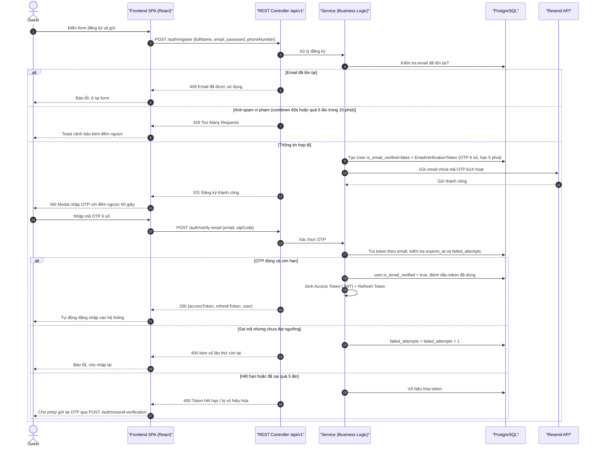
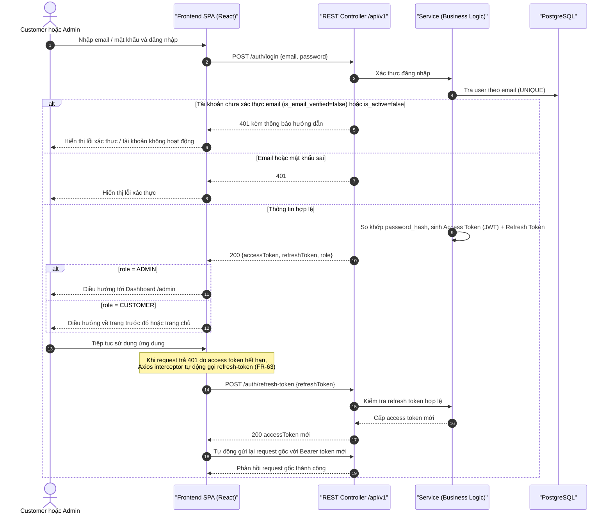

# Sequence Diagrams – Authentication (Đăng ký OTP, Đăng nhập, Refresh Token)

## Purpose

Mô tả tương tác giữa Guest/Customer/Admin, Frontend SPA, Backend API và các thành phần dữ liệu/dịch vụ ngoài trong các luồng xác thực: đăng ký + OTP email, đăng nhập và làm mới phiên.

## Source

- API §4 Authentication API (`register`, `verify-email`, `resend-verification`, `login`, `refresh-token`, `me`)
- docs/02_EcoMart_Diagrams.md §3; FR-60…FR-66
- NFR-21/22 (cooldown 60s, 5 lần / 15 phút, tối đa 5 lần sai OTP); FR-63 (refresh token), FR-64 (get me)
- Wireframe §3.5–§3.7 (phân luồng điều hướng sau login theo role)

## Diagram

### 1. Đăng ký tài khoản & Xác thực email bằng mã OTP

### 2. Đăng nhập & Làm mới phiên (Refresh Token)

## Ghi chú

- `GET /auth/me` cho phép client lấy profile + vai trò từ Bearer Token (FR-64) — luồng đơn giản GET trực tiếp nên không vẽ riêng.
- Secret key (JWT_SECRET, RESEND_API_KEY…) nạp 100% qua `.env`, không hardcode (NFR-23).
