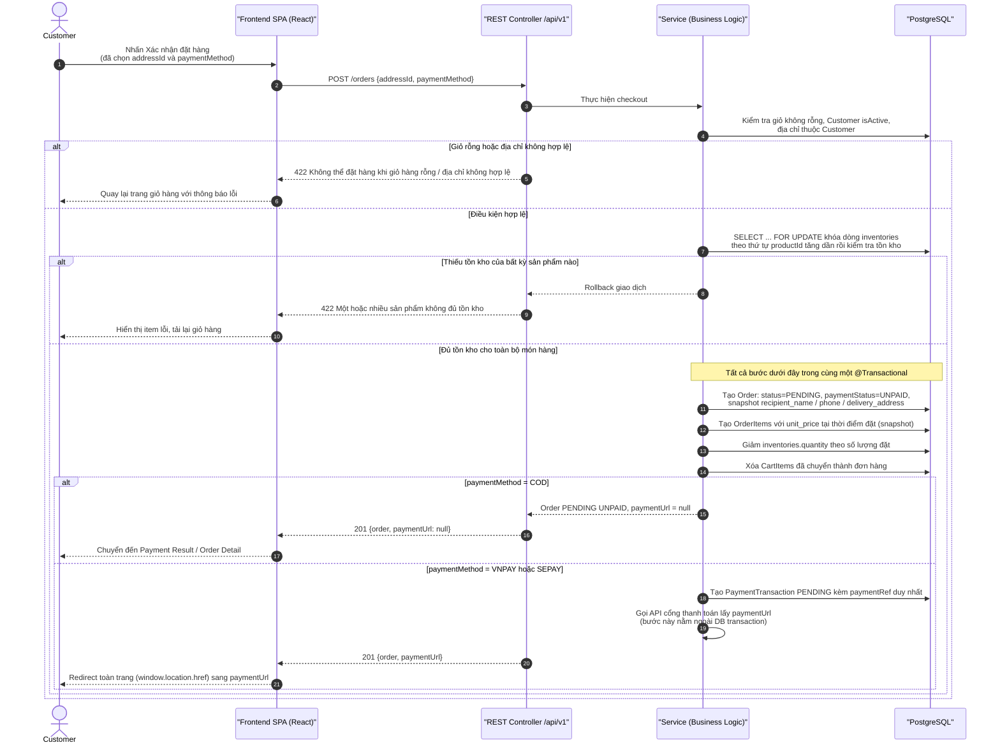

# Sequence Diagram – Checkout & Tạo đơn hàng

## Purpose

Mô tả luồng tạo đơn hàng từ giỏ hàng: kiểm tra điều kiện, khóa tồn kho chống oversell, snapshot đơn hàng, trừ tồn kho, xóa giỏ và khởi tạo giao dịch thanh toán online (nếu có).

## Source

- API §6.4 `POST /orders` — 7 bước bắt buộc trong một giao dịch
- BR-15…BR-18 (giỏ không rỗng, kiểm tra tồn kho lại trước khi tạo, snapshot giá, giảm tồn kho)
- ERD-R-08 (khóa dòng inventories theo product_id tăng dần), ERD-R-09 (snapshot)
- docs/04_EcoMart_database_design.md §8 (Transaction rules); FR-55/FR-56

## Diagram

## Ghi chú

- Nếu bước gọi cổng thanh toán thất bại, **đơn hàng đã tạo vẫn giữ nguyên**; Customer có thể dùng `POST /orders/{orderId}/retry-payment` để tạo phiên thanh toán mới (API §6.4).
- Giá sản phẩm thay đổi sau này không ảnh hưởng đơn đã tạo (BR-17).
- Luồng tiếp theo sau redirect xem [payment-vnpay.md](payment-vnpay.md) hoặc [payment-sepay.md](payment-sepay.md).
