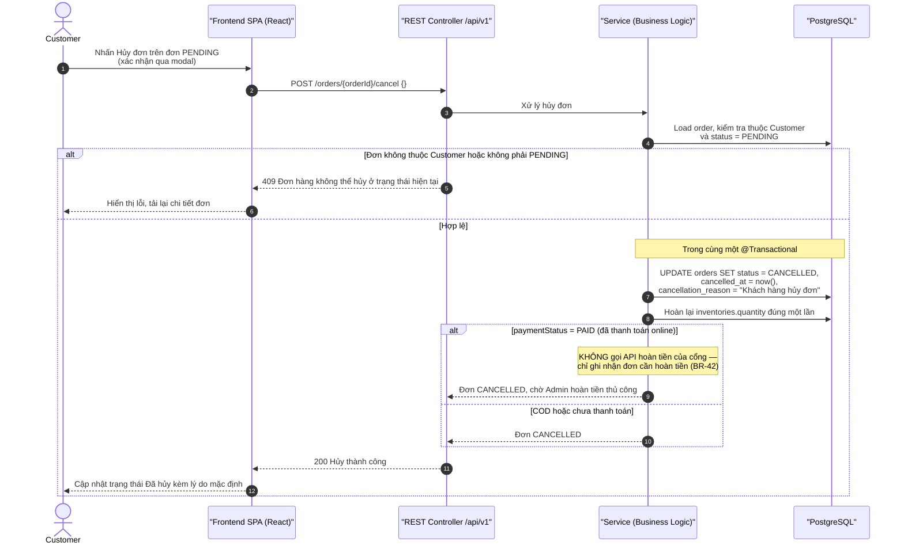
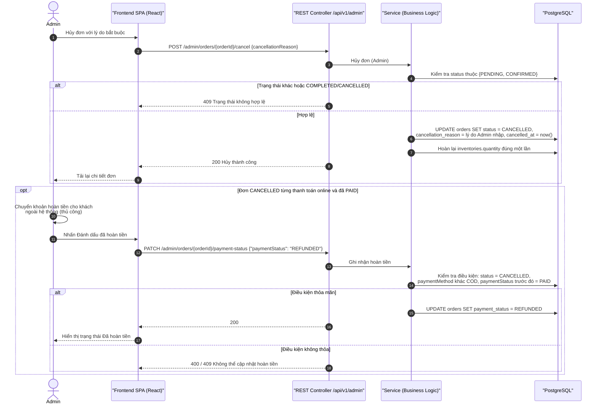

# Sequence Diagrams – Hủy đơn hàng & Hoàn tiền thủ công

## Purpose

Mô tả hai luồng hủy đơn: (1) Customer tự hủy đơn đang `PENDING`, (2) Admin hủy đơn `PENDING`/`CONFIRMED` kèm lý do bắt buộc; cùng bước ghi nhận hoàn tiền thủ công `REFUNDED` cho đơn online đã thanh toán.

## Source

- BR-21…BR-23 (điều kiện hủy, hoàn tồn kho, lý do), BR-42 (hoàn tiền thủ công), ERD-R-18
- API §6.4 `POST /orders/{orderId}/cancel`, §7.5 `/admin/orders/{orderId}/cancel`, `PATCH /admin/orders/{orderId}/payment-status`
- docs/04_EcoMart_database_design.md §8 (hủy đơn trong cùng transaction)
- docs/02_EcoMart_Diagrams.md §5 + bảng §5.1

## Diagram

### 1. Customer hủy đơn chưa xác nhận

### 2. Admin hủy đơn & ghi nhận hoàn tiền thủ công

## Business Rules áp dụng

| Rule | Ý nghĩa trong luồng |
|---|---|
| BR-21 | Customer chỉ hủy khi `PENDING`; hệ thống tự gán lý do "Khách hàng hủy đơn" |
| BR-22/BR-34 | Admin xác nhận chỉ từ `PENDING`; đơn `COMPLETED` không thể quay lại trạng thái cũ |
| BR-23 | Admin hủy được `PENDING`/`CONFIRMED`, bắt buộc lưu lý do, hoàn tồn kho |
| BR-25 | Đơn `COMPLETED`/`CANCELLED` không được xóa |
| BR-42/ERD-R-18 | `REFUNDED` là thao tác ghi nhận thủ công, không gọi API cổng thanh toán |
