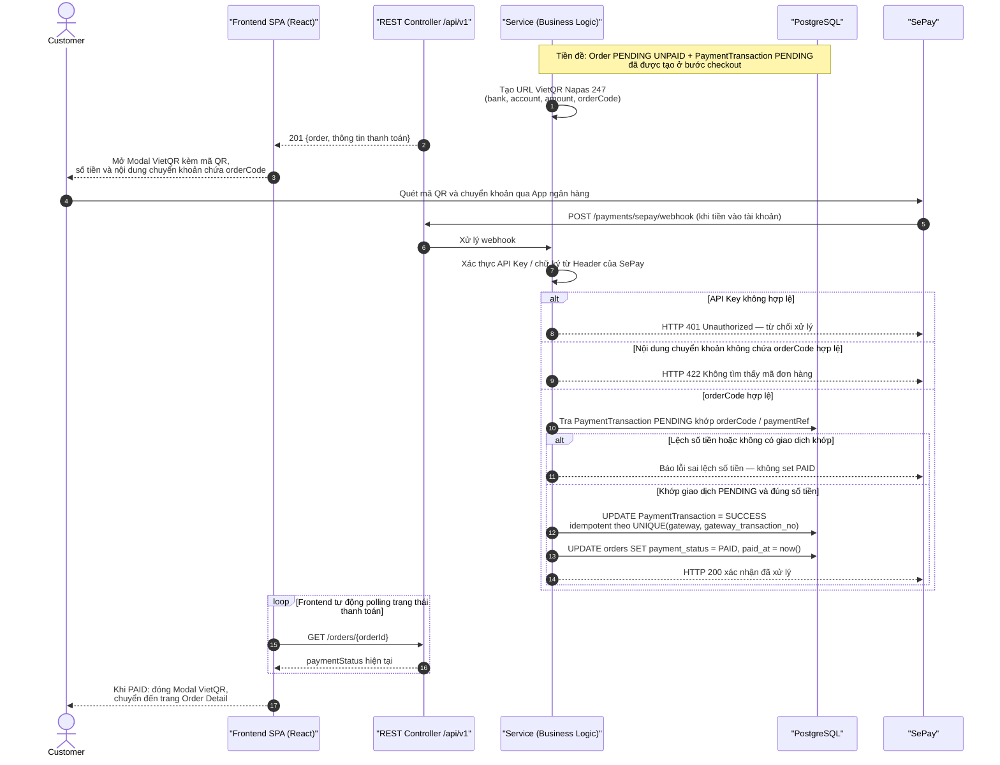

# Sequence Diagram – Thanh toán online qua SePay (VietQR Napas 247)

## Purpose

Mô tả luồng thanh toán SePay: hiển thị modal VietQR, Customer chuyển khoản qua app ngân hàng, SePay gọi webhook về server với xác thực API Key, đối chiếu mã đơn và số tiền trước khi set `PAID`; Frontend polling trạng thái.

## Source

- API §6.6 (`POST /payments/sepay/webhook` — xác thực API key header, idempotent)
- docs/02_EcoMart_Diagrams.md §6; README (SePay VietQR Napas 247)
- Checklist Module 9 (modal QR `img.vietqr.io`, nội dung chuyển khoản `EM-XXXXXXXX`, tự động polling)
- BR-40…BR-43; ERD-R-12, ERD-R-17

## Diagram

## Business Rules áp dụng

| Rule | Ý nghĩa trong luồng |
|---|---|
| BR-40/NFR-19 | `PAID` chỉ khi webhook hợp lệ; redirect/modal không phải căn cứ xác nhận |
| BR-41 | Đơn chỉ coi là đã thanh toán khi có ít nhất một giao dịch thành công **khớp đơn hàng và số tiền** |
| BR-43/ERD-R-17 | Webhook sai xác thực bị từ chối; gọi lại không tạo hiệu ứng trùng |
| FR-57/NFR-20 | Secret/API key của SePay chỉ tồn tại phía backend |

> Thất bại/chưa hoàn tất: Customer dùng `POST /orders/{orderId}/retry-payment` để tạo giao dịch mới (API §6.4).
