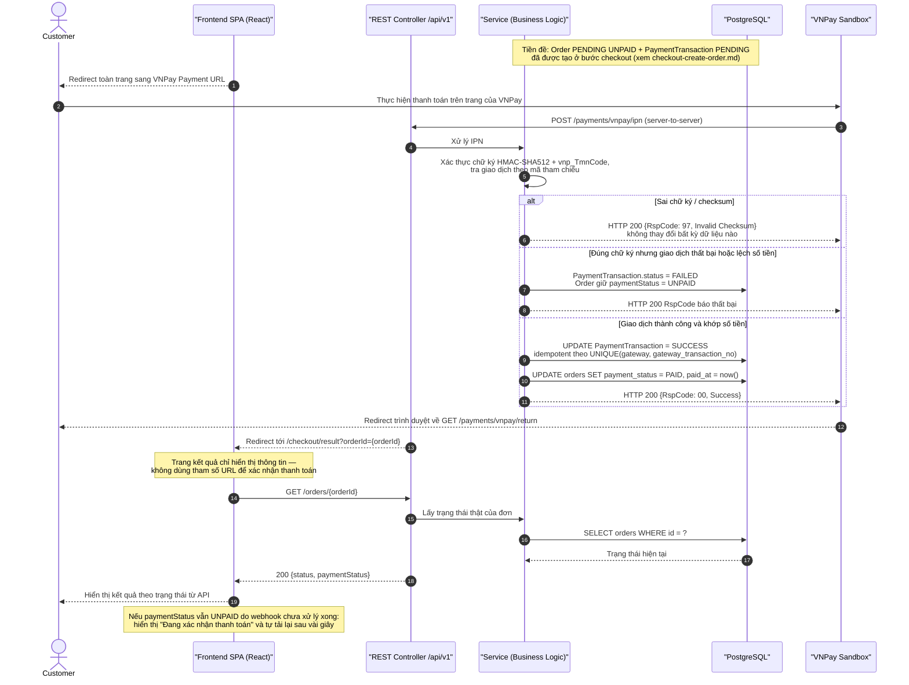

# Sequence Diagram – Thanh toán online qua VNPay Sandbox

## Purpose

Mô tả luồng thanh toán VNPay: redirect sang cổng, nhận IPN server-to-server với xác thực HMAC-SHA512, cập nhật trạng thái thanh toán và xử lý trang kết quả (chỉ hiển thị, không xác nhận).

## Source

- API §6.6 Payment Gateway Webhook API (`/payments/vnpay/ipn`, `/payments/vnpay/return`), §9.5 ví dụ lỗi chữ ký
- docs/02_EcoMart_Diagrams.md §6; FR-56/FR-57
- BR-40/BR-43, NFR-19/20; ERD-R-12, ERD-R-17 (idempotency)
- Wireframe §4.5 Payment Result (không tin query string redirect)

## Diagram

## Business Rules áp dụng

| Rule | Ý nghĩa trong luồng |
|---|---|
| BR-40/NFR-19 | `PAID` chỉ khi IPN hợp lệ; không tin dữ liệu từ trình duyệt |
| BR-43 | Chữ ký sai → từ chối, dữ liệu không đổi |
| ERD-R-17 | Webhook gọi lại nhiều lần không tạo giao dịch trùng hay cộng dồn hiệu ứng |
| BR-42 | Nếu đơn PAID bị hủy sau này → hoàn tiền thủ công, xem [order-cancel-refund.md](order-cancel-refund.md) |

> Luồng thất bại: Customer có thể thử lại bằng `POST /orders/{orderId}/retry-payment` khi đơn còn `PENDING` và `paymentStatus ∈ {UNPAID, FAILED}` (API §6.4).
