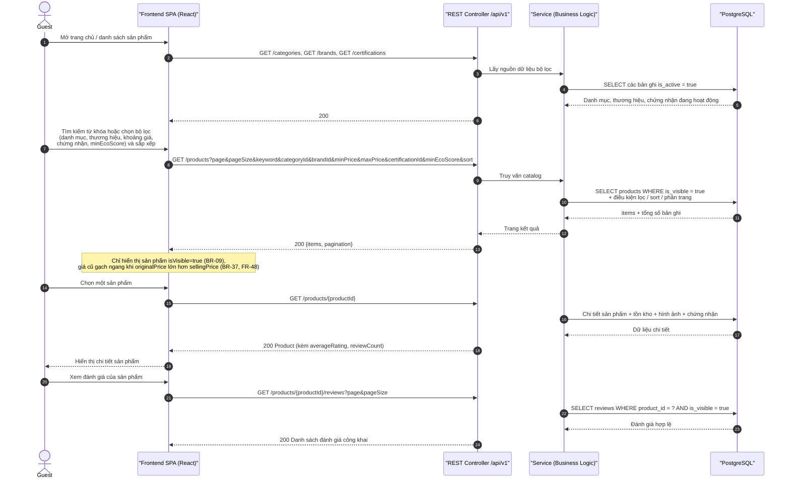

# Sequence Diagram – Duyệt sản phẩm (Public Catalog)

## Purpose

Mô tả tương tác đọc dữ liệu công khai: xem danh mục/thương hiệu/chứng nhận, tìm kiếm – lọc – sắp xếp sản phẩm, xem chi tiết và đánh giá công khai của sản phẩm.

## Source

- API §5 Public Catalog API
- FR-01…FR-08, FR-43…FR-45 (tìm kiếm/lọc/sắp xếp), FR-30/FR-48 (đánh giá công khai, giá khuyến mại)
- BR-09 (chỉ hiển thị sản phẩm đang hiển thị), NFR-08 (phân trang), NFR-06/07 (hiệu năng phản hồi)

## Diagram

## Ghi chú

- Các endpoint này **PUBLIC**, không yêu cầu Bearer token (API §5).
- Sản phẩm hết hàng vẫn hiển thị nhưng không thể thêm vào giỏ hàng (API §5.1).
- Thông tin review công khai không bao gồm dữ liệu nhạy cảm của Customer (API §5.2).
