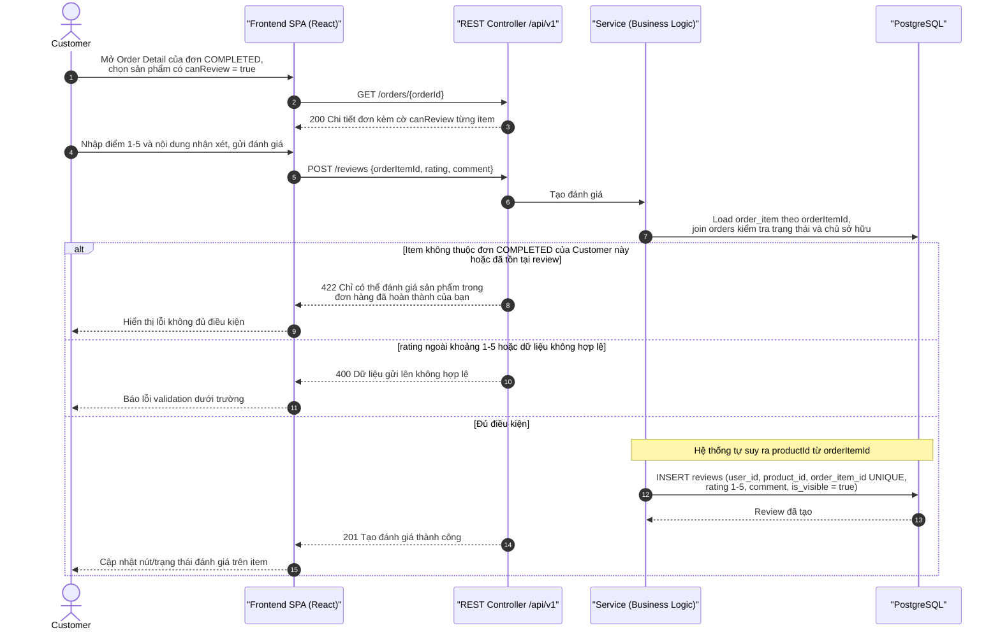
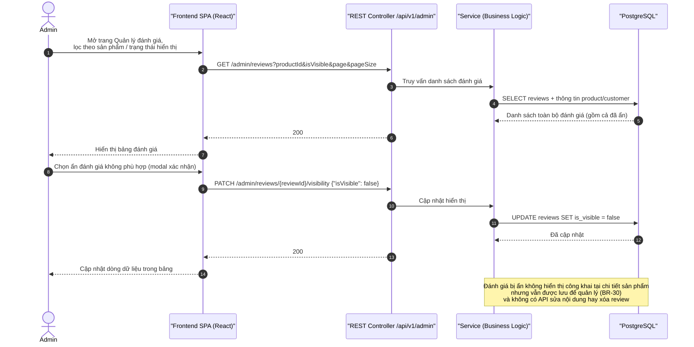

# Sequence Diagrams – Đánh giá sản phẩm & Kiểm duyệt

## Purpose

Mô tả (1) Customer gửi đánh giá cho sản phẩm thuộc đơn `COMPLETED` với toàn bộ kiểm tra điều kiện, (2) Admin xem và ẩn/hiện đánh giá.

## Source

- API §6.5 (`POST /reviews` — suy ra `productId` từ `orderItemId`, `422` nếu không đủ điều kiện; `PATCH /reviews/{reviewId}`), §7.6 (`GET /admin/reviews`, `PATCH /admin/reviews/{reviewId}/visibility`)
- BR-27…BR-30; ERD-R-13/14; FR-29…FR-30, FR-41
- Wireframe §5.8 Review Management

## Diagram

### 1. Customer gửi đánh giá

### 2. Admin kiểm duyệt đánh giá

## Business Rules áp dụng

| Rule | Ý nghĩa trong luồng |
|---|---|
| BR-27 | Chỉ đánh giá sản phẩm thuộc đơn `COMPLETED` của chính Customer |
| BR-28 | Một review mỗi order item — ràng buộc `order_item_id` UNIQUE |
| BR-29 | rating nguyên từ 1 đến 5 |
| BR-30 | Ẩn chỉ đổi `is_visible`; review vẫn được lưu |
| NFR-18 | Thao tác ẩn/hiện đánh giá của Admin được ghi log |
