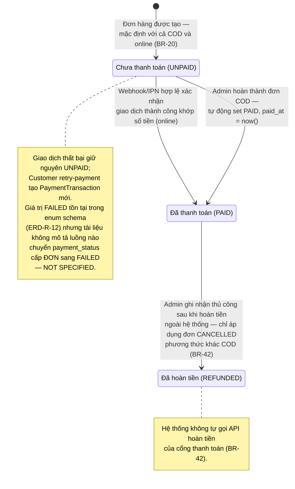

# State Diagram – Trạng thái thanh toán của đơn hàng (`orders.payment_status`)

## Purpose

Mô tả vòng đời trạng thái thanh toán của một đơn hàng. Trạng thái này **độc lập** với trạng thái xử lý đơn (`orders.status`) và chỉ được thay đổi khi có webhook/IPN hợp lệ hoặc thao tác Admin được tài liệu cho phép.

## Source

- docs/02_EcoMart_Diagrams.md §1 (trạng thái thanh toán độc lập) + §5/§6
- BR-20, BR-40, BR-42; ERD-R-12; API §6.6, §7.5 (`payment-status`), §8 bảng ánh xạ BR

## Diagram

## Bảng transition rút gọn

| From | To | Điều kiện / tác nhân | Nguồn |
|---|---|---|---|
| `[*] → UNPAID` | Tạo đơn (COD & online) | Tự động | BR-20 |
| `UNPAID → PAID` | Webhook/IPN hợp lệ + khớp số tiền | Hệ thống | BR-40/41 |
| `UNPAID → PAID` | Hoàn thành đơn COD | Admin `/complete` tự set | docs 02 §5.1 |
| `PAID → REFUNDED` | Đơn đã `CANCELLED`, method ≠ `COD`, hoàn tiền ngoài hệ thống xong | Admin `PATCH /admin/orders/{orderId}/payment-status` | BR-42, ERD-R-18 |
| `UNPAID → ?` khi giao dịch FAILED | Giữ `UNPAID`; chuyển sang `FAILED` cấp đơn **không được mô tả** | — | API §6.6 bước 4 |

> Lưu ý nhất quán: `FAILED` là trạng thái của **PaymentTransaction**, không phải của đơn hàng theo các luồng được mô tả — xem [payment-transaction-status.md](payment-transaction-status.md).
