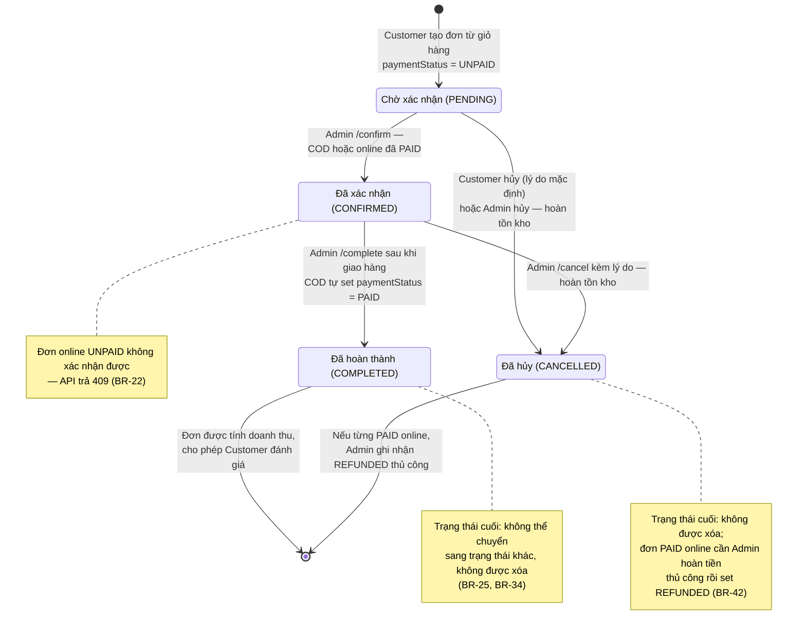

# State Diagram – Trạng thái xử lý đơn hàng (`orders.status`)

## Purpose

Mô tả vòng đời trạng thái nghiệp vụ của một đơn hàng và các transition hợp lệ kèm tác nhân/điều kiện.

## Source

- docs/02_EcoMart_Diagrams.md §1 (quy ước) + bảng quy tắc chuyển trạng thái §5.1
- BR-20…BR-25, BR-34; ERD-R-10; API §7.5 (quy tắc `/confirm`, `/cancel`, `/complete`)
- BA §2.3 Quy trình xử lý đơn hàng

## Diagram

## Bảng transition rút gọn

| From | To | Tác nhân | Điều kiện | Tác động |
|---|---|---|---|---|
| `[*]` → `PENDING` | Tạo đơn | Customer | Giỏ hợp lệ, đủ tồn kho | Trừ tồn kho, snapshot giá/địa chỉ |
| `PENDING → CONFIRMED` | Xác nhận | Admin | COD hoặc online `PAID` (khác → `409`) | Ghi nhận `confirmedAt` |
| `PENDING → CANCELLED` | Hủy | Customer hoặc Admin | — | Hoàn tồn kho; lưu lý do |
| `CONFIRMED → CANCELLED` | Hủy | Admin | Lý do bắt buộc | Hoàn tồn kho |
| `CONFIRMED → COMPLETED` | Hoàn thành | Admin | Sau khi giao thành công | Ghi nhận `completedAt`; COD auto `PAID`; tính doanh thu; mở điều kiện đánh giá |
