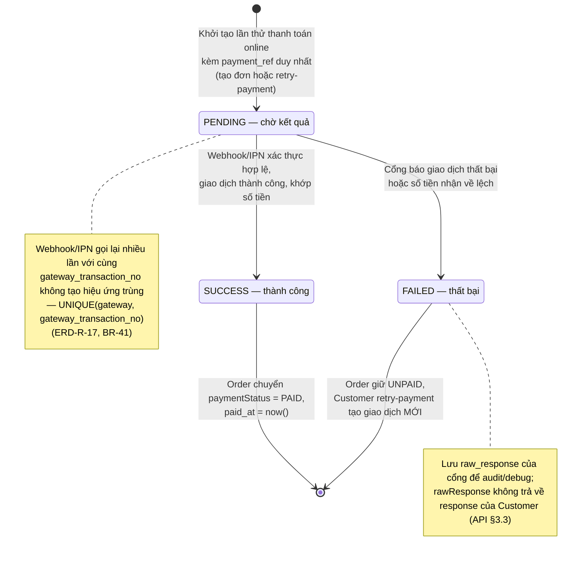

# State Diagram – Trạng thái giao dịch thanh toán (`payment_transactions.status`)

## Purpose

Mô tả vòng đời của một lần thử thanh toán online (PaymentTransaction). Mỗi lần thử là một bản ghi riêng với `payment_ref` duy nhất.

## Source

- docs/02_EcoMart_Diagrams.md §6 (VNPay IPN & SePay webhook)
- API §6.6 (xử lý webhook khi xác thực hợp lệ), §3.3 PaymentTransaction model
- ERD-R-12 (`TransactionStatus`: PENDING, SUCCESS, FAILED), ERD-R-17 (idempotency), BR-41

## Diagram

## Bảng transition rút gọn

| From | To | Điều kiện | Tác động kèm theo |
|---|---|---|---|
| `[*] → PENDING` | `POST /orders` hoặc `/retry-payment` với phương thức online | Chưa tác động đến trạng thái thanh toán của đơn |
| `PENDING → SUCCESS` | VNPay: HMAC hợp lệ + `vnp_ResponseCode = 00` + khớp tiền; SePay: API key hợp lệ + orderCode khớp + đúng tiền | Order → `PAID`, ghi `paid_at` |
| `PENDING → FAILED` | Cổng trả thất bại / lệch số tiền (chữ ký vẫn hợp lệ) | Order giữ `UNPAID`, được phép retry |
